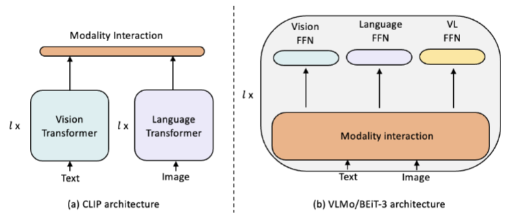

# LMM4Rec: Enhancing Recommender Systems: Deep Modality Alignment with Large Multi-Modal Encoders
This is the PyTorch implementation for LMM4Rec proposed in the paper [LMM4Rec: Enhancing Recommender Systems: Deep Modality Alignment with Large Multi-Modal Encoders](https://arxiv.org/abs/2310.20343), which is accepted by ACM TORS.



In this paper, we enhance the deep alignment of large multi-modal encoders to address the shallow alignment of modalities in multi-modal recommender systems. Specifically, we investigate the use of three state-of-the-art large multi-modal encoders — CLIP (dual-stream), VLMo and BEiT-3 (unified) — for recommendation tasks. We explore their benefits for recommendation through using a range of strategies, including the use of pre-trained and fine-tuned encoders, as well as the evaluation of the end-to-end training of these encoders. We show that pre-trained large multi-modal encoders generate more aligned and effective user/item representations compared to existing modality-specific encoders across four existing multi-modal recommendation datasets. Furthermore, we show that fine-tuning these encoders further improves the recommendation performance, with end-to-end training emerging as the most effective paradigm, significantly outperforming both pre-trained and fine-tuned encoders with an improved recommendation performance. We also demonstrate the effectiveness of large multi-modal encoders in facilitating modality alignment by evaluating the contribution of each modality separately. Finally, we show that the dual-stream approach, specifically CLIP, is the most effective architecture for these large multi-modal encoders, outperforming the unified approaches (i.e., VLMo and BEiT3) in terms of effectiveness and efficiency.

## Citation
If you want to use our codes in your research, please cite:
```
@article{yi2023large,
  title={Enhancing Recommender Systems: Deep Modality Alignment with Large Multi-Modal Encoders},
  author={Yi, Zixuan and Long, Zijun and Ounis, Iadh and Macdonald, Craig and Mccreadie, Richard},
  journal={Transactions on Recommender System},
  year={2024}
}

```

## Environment
The codes of LMM4Rec are implemented and tested under the following development environment:
* numba==0.53.1
* numpy==1.20.3
* scipy==1.6.2
* torch==1.10.3
* torch_scatter==2.0.6

## Usage: How to run the codes
* Configure the large multi-modal encoders (CLIP, BEiT-3, VLMo), multi-modal recommender systems, and all hyper-parameters in the .conf file under the directory named conf. (xx is the name of the model you want to run)</li>
* Run main.py and choose the model you want to run.</li>

